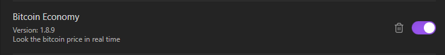
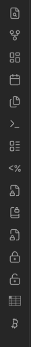
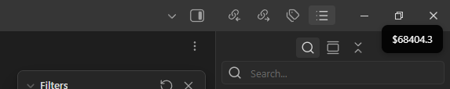

# How to use this aplication ?
## First, clone this using `git clone https://github.com/Vriizzy/Bitcoin-Plugin.git`
### After, enter the folder "Bitcoin-Plugin"
### - Right away, use `cd Bitcoin-Plugin`
### - Use `ctrl + '` in Visual Studio Code or your IDE and put `npm install`
### - Waiting for download dependecies of project...
### - Put the folder in `C:\Users\YourUser\YourVaultDirectory\YourVaultName\.obsidian\plugins\`
# Start the obsidian
### In obsidian open the settings

### - Enter in Community plugins
### - Found the `Bitcoin Economy`

### If plugin be disable, turn on 

# Using plugin

### - In left bar, click on the button with bitcoin symbol
### - Boom! You got it !
